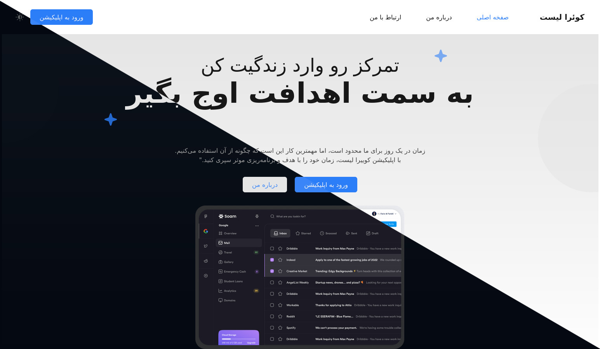

# QList
[](https://deepwiki.com/Shahryar-Pirooz/QList)



QList is a responsive landing page for a to-do list application, "Quera List". This project is built with a focus on modern UI/UX principles, featuring a clean design, theme switching capabilities, and a mobile-first approach. The entire user interface is in Persian.


## ✨ Features

*   **Responsive Design**: A fully responsive layout that adapts to various screen sizes, from mobile phones to desktops.
*   **Theme Toggling**: Switch between Light, Dark, and System-default themes. The user's preference is saved in cookies for a consistent experience across sessions.
*   **Interactive UI**: Smooth animations, a responsive navigation menu for mobile, and interactive carousels.
*   **Multi-Page Structure**: Includes a main landing page, an "About Me" page, and a "Contact Me" page.
*   **Custom Fonts**: Utilizes the 'Vazirmatn' and 'Tanha' Persian fonts for enhanced typography.

## 🛠️ Tech Stack

*   **Frontend**: HTML5, Vanilla JavaScript
*   **Styling**: Tailwind CSS
*   **Build Tool**: npm scripts with `@tailwindcss/cli`

## 🚀 Getting Started

To get a local copy up and running, follow these simple steps.

### Prerequisites

You need to have [Node.js](https://nodejs.org/) and [npm](https://www.npmjs.com/) installed on your machine.

### Installation

1.  Clone the repository:
    ```sh
    git clone https://github.com/Shahryar-Pirooz/QList.git
    ```
2.  Navigate to the project directory:
    ```sh
    cd QList
    ```
3.  Install the necessary npm packages:
    ```sh
    npm install
    ```

### Running the Project

1.  Start the Tailwind CSS compiler in watch mode. This will automatically recompile your CSS when you make changes to `src/input.css`.
    ```sh
    npm run dev
    ```
2.  Open the `index.html` file in your favorite web browser to view the landing page.

## 📁 Project Structure

```
.
├── assets/             # Contains all static assets like fonts, icons, and images
├── dist/               # Contains the compiled CSS (generated by `npm run dev`)
├── pages/              # Contains additional HTML pages (About, Contact)
├── scripts/            # Contains JavaScript files for interactivity
│   ├── darkmode.js     # Logic for theme switching
│   ├── init.js         # DOM element initializations
│   └── mobile.js       # Logic for mobile menu and carousels
├── src/                # Source files
│   └── input.css       # Main Tailwind CSS source file
├── .gitignore
├── index.html          # Main landing page
├── LICENSE             # MIT License file
└── package.json        # Project dependencies and scripts
```

## ⚖️ License

This project is licensed under the MIT License. See the [LICENSE](LICENSE) file for more details.
